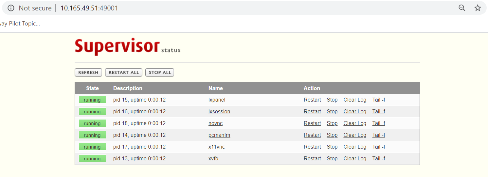
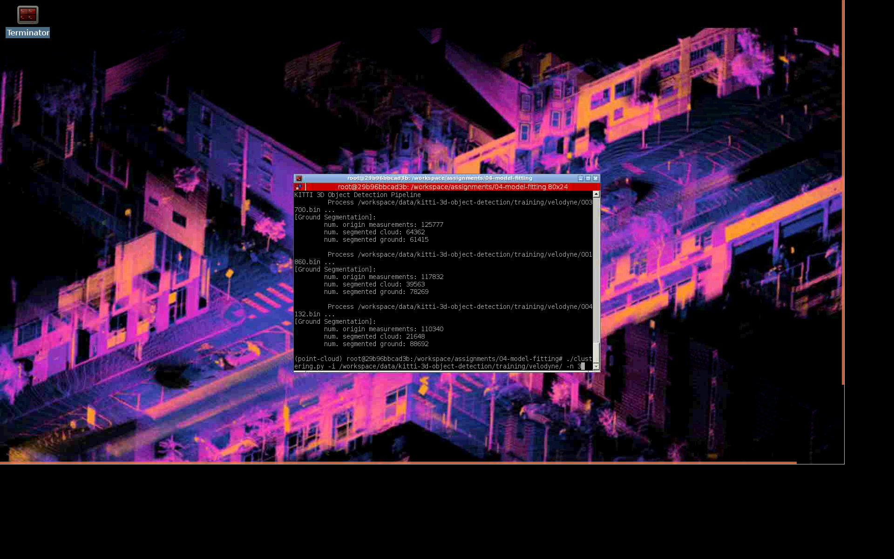

# Docker for 3D Point Cloud Analysis

This is the Docker image for open courseware 3D Point Cloud Analysis from www.shenlanxueyuan.com, China.

All source code are based upon public available resources and starter-code from www.shenlanxueyuan.com.

Please check them before disturbing me with your own stupid claims.

---

## Build Images

The environment can be built with docker-compose as follows:
```bash 
docker-compose build
```

---

## Configuration

### Volume Mounting

Local directories for source code and data are configured in **docker-compose.yml**

```yaml
    volumes:
      # assignments:
      - ${PWD}/workspace/assignments:/workspace/assignments  
      # data volume:
      - ${PWD}/workspace/data:/workspace/data
```

### Network Port Mapping

Config port mappings for supervisord monitor and VNC client access in **docker-compose.yml** 

```yaml
    ports:
      # standard vnc client:
      - 45901:5900
      # supervisord admin:
      - 49001:9001
```

---

## Up and Running 

### Launch VNC Instance
```bash
# for cpu environment, launch with docker-compose:
docker-compose up workspace-vnc
# for gpu environment, launch with nvidia-docker:
docker run \
  --gpus all \
  -v ${PWD}/workspace/assignments:/workspace/assignments \
  -v ${PWD}/workspace/data:/workspace/data \
  # ports:
  -p 49001:9001 \
  -p 45901:5900 \
  -p 46006:6006 \
  --name point_cloud_analytics_workspace anaconda/point-cloud-analysis:bionic-gpu-current
```

### Health Check

Access supervisord monitor to make sure all processes have been started: http://[HOST_IP]:49001



### VNC Access:

You can access the desktop with standard VNC client

#### VNC Client

On the system you can use 

* Remmina on Ubuntu
* TightVNC Viewer on Windows

to create a VNC session to connect to: http://[HOST_IP]:45901



---
