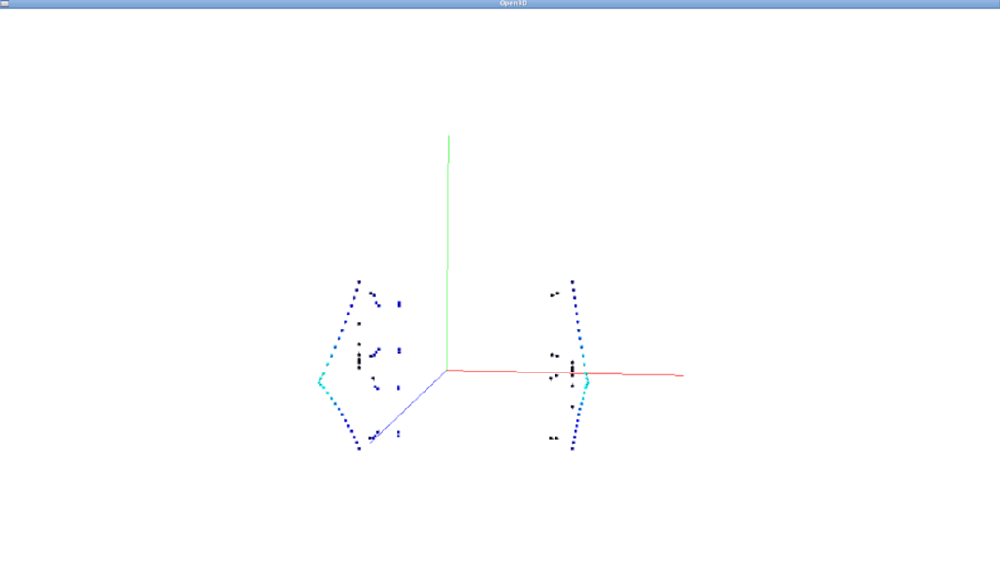
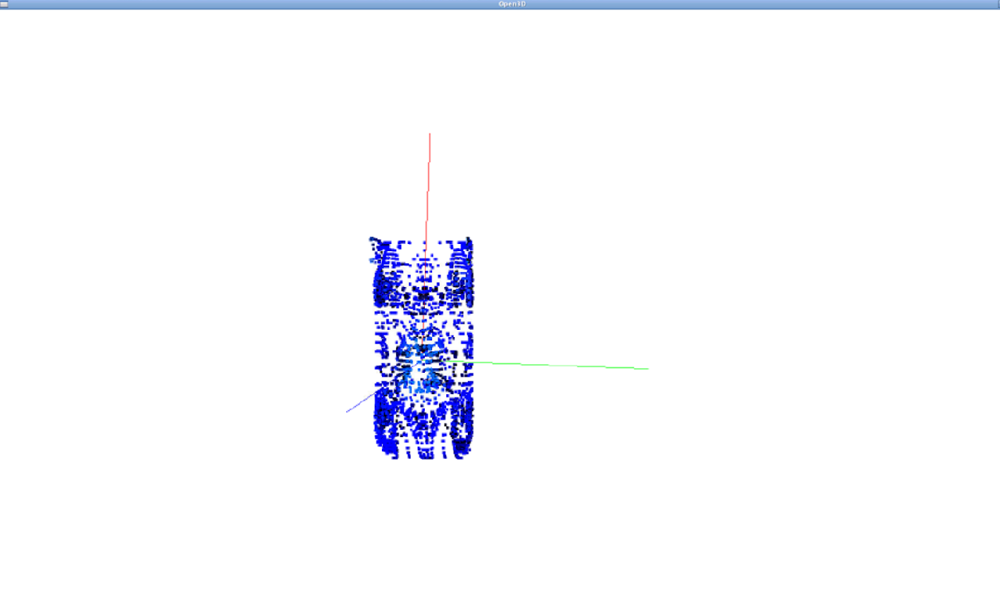
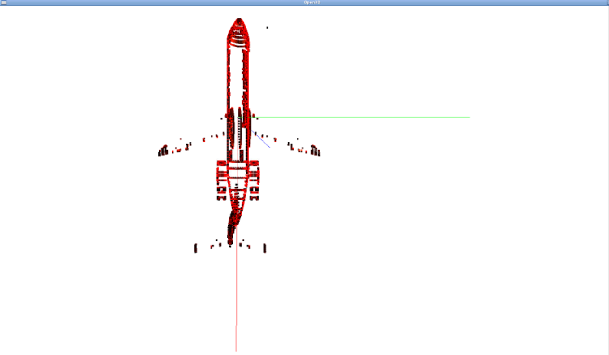
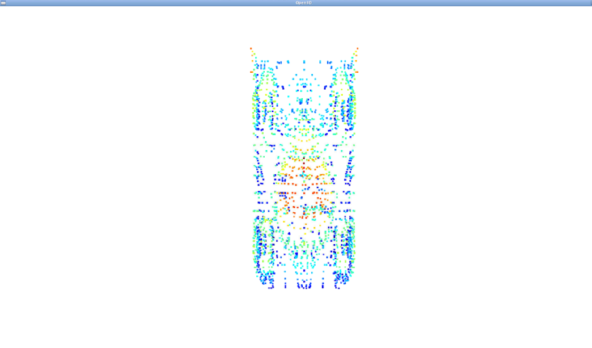
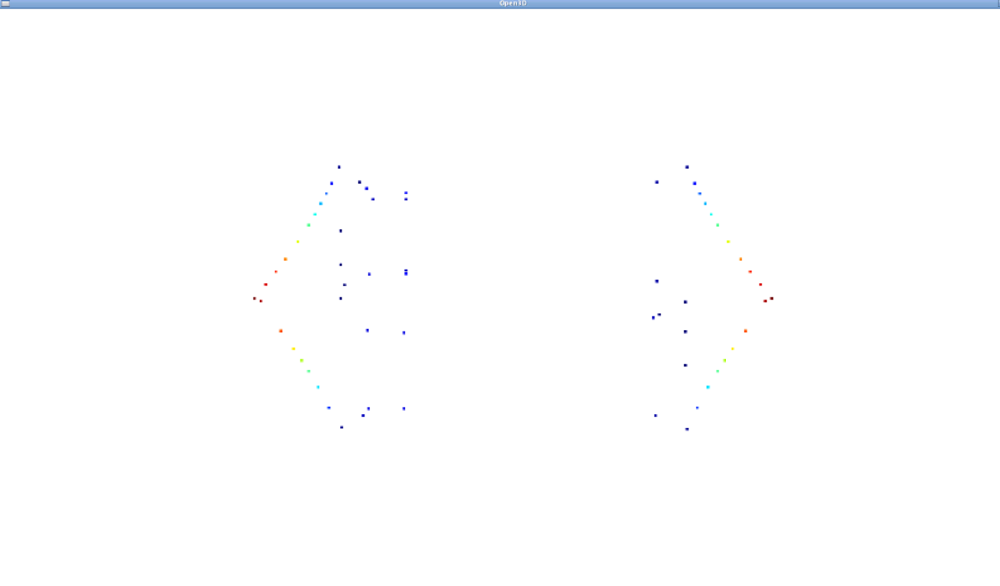

# Introduction

Python implementation of basic point cloud manipulation.

---

## Homework Solution

### 1. Build Dataset for Assignment 01

#### Download ModelNet40 Dataset

The script is available at **/workspace/data/get-modelnet40.sh**

```bash
# change directory to data folder:
cd /workspace/data
# download:
./get-modelnet40.sh
# extract:
unzip ModelNet40.zip
```

#### Select One Point Cloud from Each Category

The following Python script can be used for sample set creation

```bash
# change directory to data folder:
cd /workspace/data
# downsample:
./sample-modelnet40.py
```

### 2. Perform PCA for the 40 Objects and Visualize 

Below is the code for PCA
```python
def PCA(data, correlation=False, sort=True):
    """ Calculate PCA for given point cloud

    Parameters:
        data：点云，NX3的矩阵
        correlation：区分np的cov和corrcoef，不输入时默认为False
        sort: 特征值排序，排序是为了其他功能方便使用，不输入时默认为True
    
    Returns:
        eigenvalues：特征值
        eigenvectors：特征向量
    """

    # TODO 01: PCA
    # format as numpy array:
    N = data.shape[0]
    X = data.to_numpy()

    # normalize by center:
    mu = np.mean(X, axis=0)
    X_normalized = X - mu

    # get function:
    func = np.cov if not correlation else np.corrcoef
    H = func(X_normalized, rowvar=False, bias=True)

    # get eigen pairs:
    eigenvalues, eigenvectors = np.linalg.eig(H)

    if sort:
        sort = eigenvalues.argsort()[::-1]
        eigenvalues = eigenvalues[sort]
        eigenvectors = eigenvectors[:, sort]

    return eigenvalues, eigenvectors
```

And its visualization using Open3D LineSet

```python
def get_pca_o3d(w, v, points):
    """ Build open3D geometry for PCA

    Parameters:
        w: eigenvalues in descending order
        v: eigenvectors in descending order
    
    Returns:
        pca_set: o3d line set for pca visualization
    """
    # calculate centroid & variation along main axis:
    centroid = points.mean()
    projs = np.dot(points.to_numpy(), v[:,0])
    scale = projs.max() - projs.min()

    points = centroid.to_numpy() + np.vstack(
        (
            np.asarray([0.0, 0.0, 0.0]),
            scale * v.T
        )
    ).tolist()
    lines = [
        [0, 1],
        [0, 2],
        [0, 3]
    ]
    # from the largest to the smallest: RGB
    colors = np.identity(3).tolist()

    # build pca line set:
    pca_o3d = o3d.geometry.LineSet(
        points=o3d.utility.Vector3dVector(points),
        lines=o3d.utility.Vector2iVector(lines),
    )
    pca_o3d.colors = o3d.utility.Vector3dVector(colors)

    return pca_o3d
```

### 3. Perform Surface Normal Estimation for Each Point of Each Object and Visualize

Below is the code for surface normal estimation
```python
def get_surface_normals(pcd, points, knn=5):
    # create search tree:
    pcd_tree = o3d.geometry.KDTreeFlann(pcd)

    # init:
    N = len(pcd.points)
    normals = []

    for i in range(N):
        # find knn:
        [k, idx, _] = pcd_tree.search_knn_vector_3d(pcd.points[i], knn)
        # get normal:
        w, v = PCA(points.iloc[idx])
        normals.append(v[:, 0])

    return np.array(normals, dtype=np.float64)
```

And its visualization using Open3D LineSet

Below is one sample visualization for tents. The eigenvectors with corresponding eigenvalues in descending order are colored in R,G,B respectively.



```python
def get_surface_normals_o3d(normals, points, scale=2):
    """ Build open3D geometry for surface normals

    Parameters:
        normals(numpy.ndarray): surface normals for each point
        points(pandas.DataFrame): points in the point cloud
        scale(float): the length of each surface normal vector

    Returns:
        surface_normals_o3d: o3d line set for surface normal visualization
    """
    # total number of points:
    N = points.shape[0]

    points = np.vstack(
        (points.to_numpy(), points.to_numpy() + scale * normals)
    )
    lines = [[i, i+N] for i in range(N)]
    colors = np.zeros((N, 3)).tolist()

    # build pca line set:
    surface_normals_o3d = o3d.geometry.LineSet(
        points=o3d.utility.Vector3dVector(points),
        lines=o3d.utility.Vector2iVector(lines),
    )
    surface_normals_o3d.colors = o3d.utility.Vector3dVector(colors)

    return surface_normals_o3d
```

Below are two sample visualization for airplane and car. Surface normal for the given point is drawn in black on each point.




### 4. Dowmsample Each Object using Voxel Grid Downsampling(Exact, Centroid and Random) and Visualize

Voxel grid filtering can be implemented efficiently using point cloud in Pandas format
```python
def get_voxel_grid_classifier(points, leaf_size):
    """ Get a function for 3D point -- voxel grid assignment

    Parameters:
        points(pandas.DataFrame): points in the point cloud
    """
    # get bounding box:
    (p_min, p_max) = (points.min(), points.max())
    (D_x, D_y, D_z) = (
        np.ceil((p_max['x'] - p_min['x']) / leaf_size).astype(np.int),
        np.ceil((p_max['y'] - p_min['y']) / leaf_size).astype(np.int),
        np.ceil((p_max['z'] - p_min['z']) / leaf_size).astype(np.int),
    )
    
    def classifier(x, y, z):
        """ assign given 3D point to voxel grid

        Parameters:
            x(float): X
            y(float): Y
            z(float): Z
        
        Return:
            idx(int): voxel grid index
        """
        (i_x, i_y, i_z) = (
            np.floor((x - p_min['x']) / leaf_size).astype(np.int),
            np.floor((y - p_min['y']) / leaf_size).astype(np.int),            
            np.floor((z - p_min['z']) / leaf_size).astype(np.int),
        )

        idx = i_x + D_x * i_y + D_x * D_y * i_z

        return idx

    return classifier

def voxel_filter(points, leaf_size, method='centroid'):
    """ Downsample point cloud using voxel grid

    Parameters:
        points(pandas.DataFrame): points in the point cloud
        leaf_size(float): voxel grid resolution
        method(str): downsample method. 'centroid' or 'random'. defaults to 'centroid'

    Returns:
        filtered_points(numpy.ndarray): downsampled point cloud
    """
    filtered_points = None
    
    # TODO 03: voxel grid filtering
    working_points = points.copy(deep = True)

    # get voxel grid classifier:
    classifier = get_voxel_grid_classifier(working_points, leaf_size)
    # assign to voxel grid:
    working_points['voxel_grid_id'] = working_points.apply(
        lambda row: classifier(row['x'], row['y'], row['z']), axis = 1
    )
    
    # centroid:
    if method == 'centroid':
        filtered_points = working_points.groupby(['voxel_grid_id']).mean().to_numpy()
    elif method == 'random':
        filtered_points = working_points.groupby(['voxel_grid_id']).apply(
            lambda x: x[['x', 'y', 'z']].sample(1)
        ).to_numpy()

    return filtered_points
```

Below are the filtered point clouds for airplane, car and tent.





