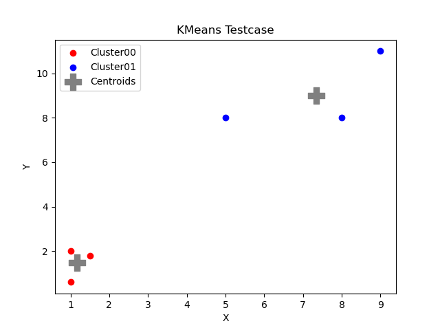
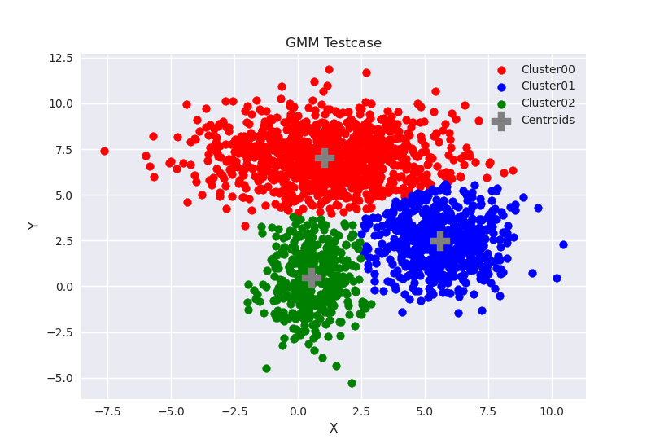
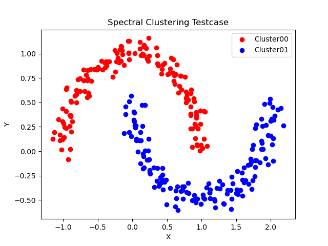
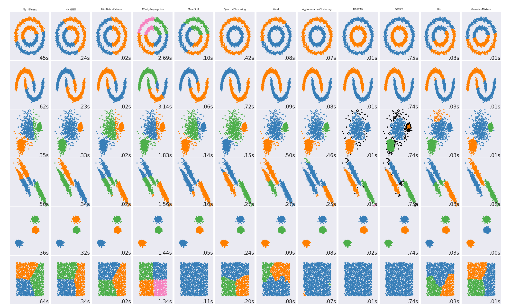

# Clustering

Python implementation of KMeans++, GMM and Spectral Clustering for clustering algorithm analysis.

---

## Homework Solution

### KMeans

The implementation, which follows the practice of Python OOAD, is available at (click to follow the link) **[/workspace/assignments/03-clustering/KMeans.py](KMeans.py)**

First is the code for **fit**. Here the training set is further formatted as Pandas dataframe for easy analytics inspired by corresponding map-reduce implementation.

```python
    def fit(self, data):
        """
        Estimate the K centroids

        Parameters
        ----------
        data: numpy.ndarray
            Training set as N-by-D numpy.ndarray

        """
        # get input size:
        N, D = data.shape
        # format as pandas dataframe:
        __data = pd.DataFrame(
            data = data,
            index = np.arange(N),
            columns = [f'x{i:03d}' for i in range(D)]
        )
        __data['cluster'] = 0

        # get tolerance:
        self.__tolerance = KMeans.__tolerance(data, self.__tolerance)
        # get initial centroids:
        self.__centroids = self.__get_init_centroid_random(data)

        # iterate:
        for iter in range(self.__max_iter):
            # expectation:
            __data.cluster = __data.apply(
                lambda x: KMeans.__assign(x[:-1].values, self.__centroids),
                axis = 1
            )
            # maximization:
            new_centroids = __data.groupby(['cluster']).mean().values
            
            # evaluate squared diff:
            diff = (new_centroids - self.__centroids).ravel()
            squared_diff = np.dot(diff, diff)
            

            # update centroids:
            self.__centroids = new_centroids

            # early stopping check:
            if squared_diff <= self.__tolerance:
                print(f'[KMeans - Fit]: early stopping with squared centroids diff {squared_diff:.2f} at iteration {iter:03d}')
                break
```

Next comes the logic for **predict**. Here brute-force method based on numpy intrinsic parallel computing is used for simplicity.

```python
    def predict(self, data):
        """
        Classify input data

        Parameters
        ----------
        data: numpy.ndarray
            Testing set as N-by-D numpy.ndarray

        """
        N, _ = data.shape

        result = np.asarray(
            [KMeans.__assign(data[i], self.__centroids) for i in range(N)]
        )

        return result    
```

To run the test case, launch the docker environment and go to **/workspace/assignments/03-clustering/** and run the following commands:

```bash
# go to HW3 working dir:
cd /workspace/assignments/03-clustering
# activate environment:
source activate point-cloud
# KMeans:
./KMeans.py
```

The result clustering is as follows:



### GMM

The implementation, which follows the practice of Python OOAD, is available at (click to follow the link) **[/workspace/assignments/03-clustering/GMM.py](GMM.py)**

First is the code for **fit**. Here the GMM params are initialized using KMeans++. GMM is in essence a local optimization algorithm thus a good initialization does matter.

```python
    def fit(self, data):
        """
        Estimate GMM parameters

        Parameters
        ----------
        data: numpy.ndarray
            Training set as N-by-D numpy.ndarray

        """
        N, _ = data.shape

        # init GMM params:
        self.__init_kmeans(data)

        # iterate:
        for i in range(self.__max_iter):
            # expectation:
            self.__get_expectation(data)

            # get effective count:
            effective_count = np.sum(self.__posteriori, axis=1)

            # maximization:
            self.__mu = np.asarray(
                [np.dot(self.__posteriori[k], data)/effective_count[k] for k in range(self.__K)]
            )
            self.__cov = np.asarray(
                [
                    np.dot(
                        (data - self.__mu[k]).T, np.dot(np.diag(self.__posteriori[k].ravel()), data - self.__mu[k])
                    )/effective_count[k] for k in range(self.__K)
                ]
            )
            self.__priori = (effective_count / N).reshape((self.__K, 1))

    def __init_kmeans(self, data):
        """
        Set initial GMM params with K-Means initialization

        Parameters
        ----------
        data: numpy.ndarray
            Training set as N-by-D numpy.ndarray

        """
        N, _ = data.shape

        # init kmeans:
        k_means = KMeans(init='k-means++', n_clusters=self.__K)
        k_means.fit(data)
        category = k_means.labels_

        # init posteriori:
        self.__posteriori = np.zeros((self.__K, N))
        # init mu:
        self.__mu = k_means.cluster_centers_
        # init covariances
        self.__cov = np.asarray(
            [np.cov(data[category == k], rowvar=False) for k in range(self.__K)]
        )
        # init priori:
        value_counts = pd.Series(category).value_counts()
        self.__priori = np.asarray(
            [value_counts[k]/N for k in range(self.__K)]
        ).reshape((3, 1))
```

Next comes the logic for **predict**. Here category is estimated using Maximum-A-Posteriori(MAP).

```python
    def predict(self, data):
        """
        Classify input data

        Parameters
        ----------
        data: numpy.ndarray
            Testing set as N-by-D numpy.ndarray

        """
        # get posteriori:
        self.__get_expectation(data)

        result = np.argmax(self.__posteriori, axis = 0)

        return result 
```

To run the test case, launch the docker environment and go to **/workspace/assignments/03-clustering/** and run the following commands:

```bash
# go to HW3 working dir:
cd /workspace/assignments/03-clustering
# activate environment:
source activate point-cloud
# GMM:
./GMM.py
```

The result clustering is as follows:



---

### Spectral Clustering

The implementation, which follows the practice of Python OOAD, is available at (click to follow the link) **[/workspace/assignments/03-clustering/SpectralClustering.py](SpectralClustering.py)**

First is the code for **fit**.

```python
    def fit(self, data):
        """
        Estimate the K centroids

        Parameters
        ----------
        data: numpy.ndarray
            Training set as N-by-D numpy.ndarray

        """
        # TODO 01: implement SpectralClustering fit 
        from sklearn.neighbors import kneighbors_graph
        from sklearn.metrics import pairwise_distances
        from scipy.sparse import csgraph
        from scipy.sparse import linalg

        N, _ = data.shape

        # create affinity matrix -- kNN for connectivity:
        A = pairwise_distances(data)
        # TODO: use better gamma estimation
        gamma = np.var(A)/4
        A = np.exp(-A**2/(2*gamma**2))
        # get laplacian matrix:
        L = csgraph.laplacian(A, normed=True)
        # spectral decomposition:
        eigval, eigvec = np.linalg.eig(L)
        # get features:
        idx_k_smallest = np.where(eigval < np.partition(eigval, self.__K)[self.__K])
        features = np.hstack([eigvec[:, i] for i in idx_k_smallest])
        # cluster using KMeans++
        k_means = KMeans(init='k-means++', n_clusters=self.__K, tol=1e-6)
        k_means.fit(features)
        # get cluster ids:
        self.__labels = k_means.labels_
```

Next comes the logic for **predict**. The implementation follows the sklearn practice and just returns the *labels_* attribute for benchmark.

```python
    def predict(self, data):
        """
        Get cluster labels

        """
        return np.copy(self.__labels)
```

To run the test case, launch the docker environment and go to **/workspace/assignments/03-clustering/** and run the following commands:

```bash
# go to HW3 working dir:
cd /workspace/assignments/03-clustering
# activate environment:
source activate point-cloud
# SpectralClustering:
./SpectralClustering.py
```

The result clustering is as follows:



---

### Benchmark

To run the test cases, go to **/workspace/assignments/03-clustering/** and run the following commands:

```bash
# go to HW3 working dir:
cd /workspace/assignments/03-clustering
# activate environment:
source activate point-cloud
# clustering algorithm benchmark:
./compare_cluster.py
```

The results are as follows

