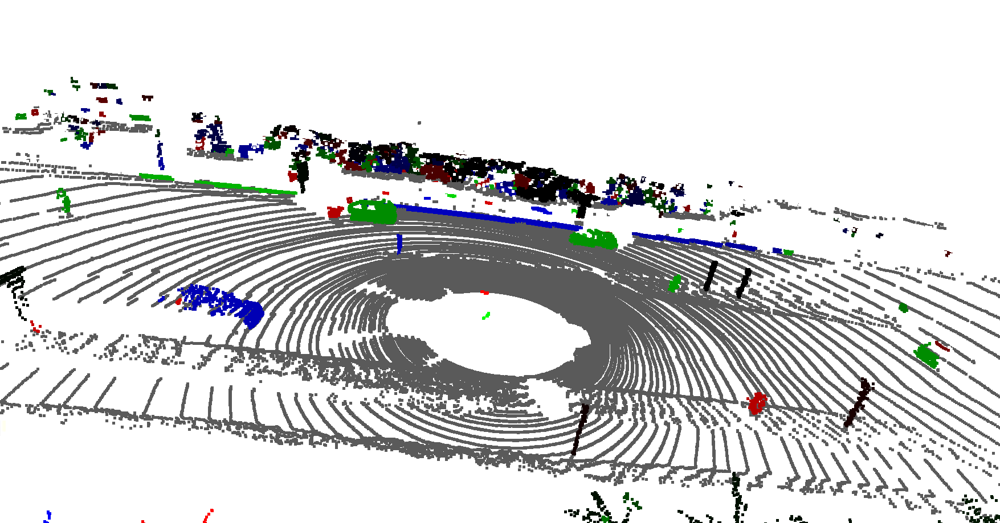
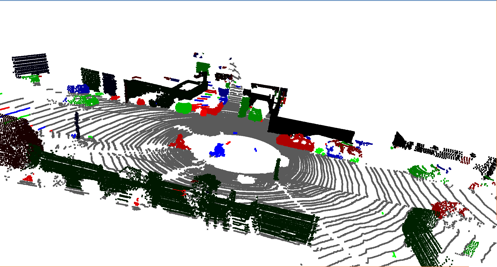
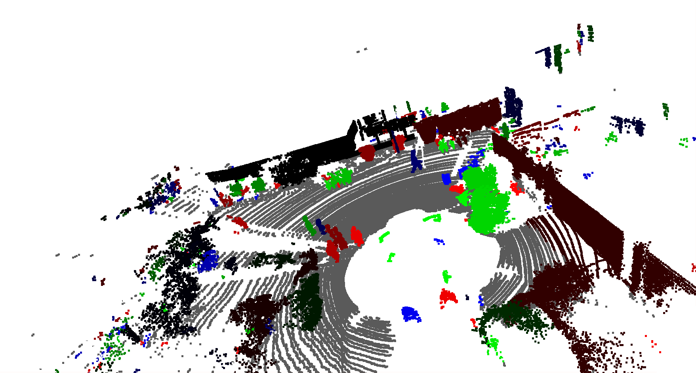

# Model Fitting

Python implementation of Ground Plane Estimation & Surrounding Object Segmentation for Assignment 04 of [3D Point Cloud Processing](https://www.shenlanxueyuan.com/course/204) from [深蓝学院](https://www.shenlanxueyuan.com/)

---

## Homework Solution

### Ground Segmentation

The implementation is available at (click to follow the link) **[/workspace/assignments/04-model-fitting/clustering.py](clustering.py)**

The whole workflow consists of 3 steps: 

* Pre-Processing: Using surface normal to filter lidar measurements
* Plane Fitting: PLANE RANSAC from PCL
* Post-Processing: Generate segmented ground by point's distance to fitted ground plane

```python
def ground_segmentation(data):
    """
    Segment ground plane from Velodyne measurement

    Parameters
    ----------
    data: numpy.ndarray
        Velodyne measurements as N-by-3 numpy.ndarray

    Returns
    ----------
    segmented_cloud: numpy.ndarray
        Segmented surrounding objects as N-by-3 numpy.ndarray
    segmented_ground: numpy.ndarray
        Segmented ground as N-by-3 numpy.ndarray

    """
    # TODO 01 -- ground segmentation
    N, _ = data.shape

    #
    # pre-processing: filter by surface normals
    #
    # first, filter by surface normal
    pcd_original = o3d.geometry.PointCloud()
    pcd_original.points = o3d.utility.Vector3dVector(data)
    pcd_original.estimate_normals(
        search_param=o3d.geometry.KDTreeSearchParamHybrid(
            radius=5.0, max_nn=9
        )
    )

    # keep points whose surface normal is approximate to z-axis for ground plane segementation:
    normals = np.asarray(pcd_original.normals)
    angular_distance_to_z = np.abs(normals[:, 2])
    idx_downsampled = angular_distance_to_z > np.cos(np.pi/6)
    downsampled = data[idx_downsampled]

    #
    # plane segmentation with RANSAC
    #
    # ground segmentation using PLANE RANSAC from PCL:
    cloud = pcl.PointCloud()
    cloud.from_array(downsampled)
    ground_segmenter = GroundSegmenter(cloud=cloud)
    inliers, model = ground_segmenter.segment()

    # 
    # post-processing: get ground output by distance to segemented plane
    # 
    distance_to_ground = np.abs(
        np.dot(data,np.asarray(model[:3])) + model[3]
    )

    idx_ground = distance_to_ground <= ground_segmenter.get_max_distance()
    idx_segmented = np.logical_not(idx_ground)

    segmented_cloud = data[idx_segmented]
    segmented_ground = data[idx_ground]

    print(
        f'[Ground Segmentation]: \n\tnum. origin measurements: {N}\n\tnum. segmented cloud: {segmented_cloud.shape[0]}\n\tnum. segmented ground: {segmented_ground.shape[0]}\n'
    )
    return segmented_cloud, segmented_ground
```

---

### Surrouding Object Segmentation

The implementation is available at (click to follow the link) **[/workspace/assignments/04-model-fitting/clustering.py](clustering.py)**

Here DBSCAN is used considering the measurement properties of Velodyne lidar.

```python
def clustering(data):
    """
    Segment surrounding objects using DBSCAN

    Parameters
    ----------
    data: numpy.ndarray
        Segmented point cloud as N-by-3 numpy.ndarray

    Returns
    ----------
    cluster_index: list of int
        Cluster ID for each point

    """
    # TODO 02 -- surrounding object segmentation
    cluster_index = DBSCAN(
        eps=0.25, min_samples=5, n_jobs=-1
    ).fit_predict(data)

    return cluster_index
```

---

### Visualization

The implementation is available at (click to follow the link) **[/workspace/assignments/04-model-fitting/clustering.py](clustering.py)**

Since matplotlib is not optimized for point cloud visualization, here another implementation based on Open3D is used.

```python
def plot_clusters(segmented_ground, segmented_cloud, cluster_index):
    """
    Visualize segmentation results using Open3D

    Parameters
    ----------
    segmented_cloud: numpy.ndarray
        Segmented surrounding objects as N-by-3 numpy.ndarray
    segmented_ground: numpy.ndarray
        Segmented ground as N-by-3 numpy.ndarray
    cluster_index: list of int
        Cluster ID for each point

    """
    def colormap(c, num_clusters):
        """
        Colormap for segmentation result

        Parameters
        ----------
        c: int 
            Cluster ID
        C

        """
        # outlier:
        if c == -1:
            color = [1]*3
        # surrouding object:
        else:
            color = [0] * 3
            color[c % 3] = c/num_clusters

        return color

    # ground element:
    pcd_ground = o3d.geometry.PointCloud()
    pcd_ground.points = o3d.utility.Vector3dVector(segmented_ground)
    pcd_ground.colors = o3d.utility.Vector3dVector(
        [
            [0.372]*3 for i in range(segmented_ground.shape[0])
        ]
    )

    # surrounding object elements:
    pcd_objects = o3d.geometry.PointCloud()
    pcd_objects.points = o3d.utility.Vector3dVector(segmented_cloud)
    num_clusters = max(cluster_index) + 1
    pcd_objects.colors = o3d.utility.Vector3dVector(
        [
            colormap(c, num_clusters) for c in cluster_index
        ]
    )

    # visualize:
    o3d.visualization.draw_geometries([pcd_ground, pcd_objects])  
```

---

### Demo

To run the test cases, go to **/workspace/assignments/03-clustering/** and run the following commands:

```bash
# go to HW4 working dir:
cd /workspace/assignments/04-model-fitting
# activate environment:
source activate point-cloud
# run segmentation on 3 random measurements from training set:
./clustering.py -i /workspace/data/kitti-3d-object-detection/training/velodyne/ -n 3
```

The results are as follows





