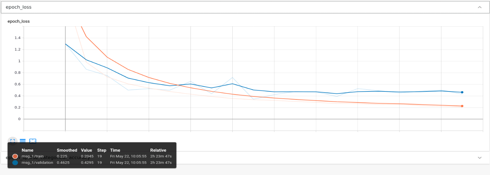
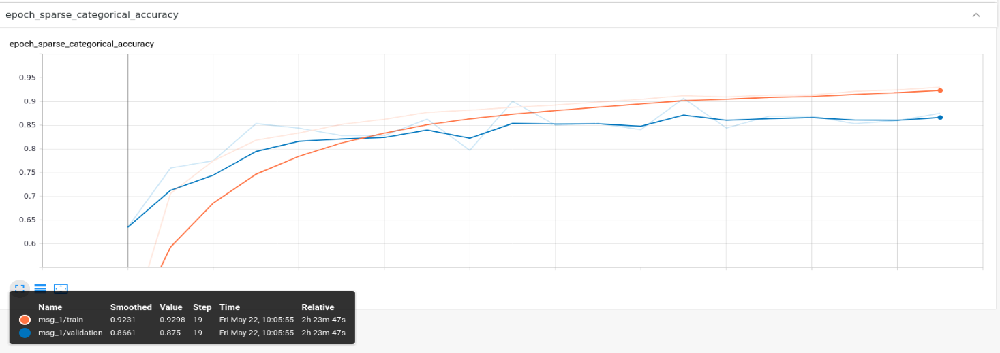

# Deep Learning Point Cloud Classification 

PointNet++ for ModelNet40(With Normal) classification, Assignment 05 of [3D Point Cloud Processing](https://www.shenlanxueyuan.com/course/204) from [深蓝学院](https://www.shenlanxueyuan.com/)

---

### Environment Setup

### Check Dependencies(Only for Native Execution)

The implementation has been tested inside **xenial-gpu** instance with the following configs: 

* Ubuntu == 16.04
* python >= 3.0+
* tensorflow-gpu == 2.2.0
* cuda == 10.1

### Build Custom Layers for PointNet++

To use **set abstraction layer** directly in TensorFlow 2, follow the instruction below and compile the implementation from [Charles Qi](https://github.com/charlesq34/pointnet2)

```bash
# go to HW5 working dir:
cd /workspace/assignments/05-deep-classification
# activate environment:
source activate point-cloud
# compile custom layers:
./tf_ops/compile_ops.sh
```

---

## Homework Solution

---

### Format ModelNet40 Dataset

In this project Tensorflow 2 is used to construct the PointNet++. So as the first step the original ModelNet40(With Normal) should be transformed into TFRecords.

The implementation is available at (click to follow the link) **[/workspace/assignments/05-deep-classification/preprocess.py](preprocess.py)**

```python
class ModelNet40Dataset:
    """
    ModelNet40 dataset for deep learning based point cloud classification

    Parameters
    ----------
    input_dir: str 
        Directory path of dataset.
    filename_labels: str
        Filename of shape labels. Defaults to 'modelnet40_shape_names.txt'.
    filename_train: str
        Filename of training set specification
    filename_test
        Filename of testing set specification

    Attributes
    ----------
    
    """
    N = 10000
    d = 3
    C = 3

    def __init__(
        self, 
        input_dir,
        filename_labels = 'modelnet40_shape_names.txt',
        filename_train = 'modelnet40_train.txt',
        size_validate = 0.20,
        filename_test = 'modelnet40_test.txt',
        random_seed=42
    ):
        # I/O spec:
        self.__input_dir = input_dir
        # load labels:
        (self.__labels, self.__encoder, self.__decoder) = self.__load_labels(filename_labels)

        # load training set:
        self.__train = np.asarray(
            self.__load_examples(filename_train)
        )
        # create validation set:
        sss = StratifiedShuffleSplit(n_splits=1, test_size=size_validate, random_state=random_seed)
        for fit_index, validate_index in sss.split(            
            self.__train, 
            # labels:
            [t.split('_')[0] for t in self.__train]
        ):
            self.__fit, self.__validate = self.__train[fit_index], self.__train[validate_index]
        # load test set:
        self.__test = self.__load_examples(filename_test)

        # remove orders:
        random.seed(random_seed)
        random.shuffle(self.__fit)
        random.shuffle(self.__validate)
        random.shuffle(self.__test)

    def __load_labels(self, filename_labels):
        """ 
        Load labels

        Parameters
        ----------
        filename_labels: str 
            Filename of dataset labels.

        """
        (labels, encoder, decoder) = (None, None, None)

        with open(os.path.join(self.__input_dir, filename_labels)) as f:
            labels = [l.strip() for l in f.readlines()]

        encoder = {label: id for id, label in enumerate(labels)}
        decoder = {id: label for id, label in enumerate(labels)}

        return (labels, encoder, decoder)

    def __load_examples(self, filename_split):
        """ 
        Load examples

        Parameters
        ----------
        filename_split: str 
            Filename of split specification.

        """
        examples = None

        with open(os.path.join(self.__input_dir, filename_split)) as f:
            examples = [e.strip() for e in f.readlines()]

        return examples

    def __get_label(self, filename_example):
        """ 
        Get label of example

        Parameters
        ----------
        filename_example: str 
            Short filename of example.

        """
        label, _ = filename_example.rsplit('_', 1)

        return label

    def __get_filename_point_cloud(self, filename_example):
        """ 
        Get relative path of example

        Parameters
        ----------
        filename_example: str 
            Short filename of example.

        """
        # get label:
        label = self.__get_label(filename_example)
        
        # generate relative filename:
        filename_point_cloud = os.path.join(
            self.__input_dir, label, filename_example
        )
        filename_point_cloud = f'{filename_point_cloud}.txt'

        return filename_point_cloud

    def __write(self, filename_examples, filename_tfrecord):
        """ 
        Save split to TFRecord

        Parameters
        ----------
        filename_examples: str 
            Filenames of split examples.
        filename_tfrecord: str 
            Filename of output TFRecord.

        """
        with tf.io.TFRecordWriter(filename_tfrecord) as writer:
            for filename_example in progressbar.progressbar(filename_examples):
                # parse point cloud:
                filename_point_cloud = self.__get_filename_point_cloud(filename_example)
                df_point_cloud_with_normal = pd.read_csv(
                    filename_point_cloud, 
                    header=None, names=['x', 'y', 'z', 'nx', 'ny', 'nz']
                )
                # get label:
                label = self.__get_label(filename_example)
                # format:
                xyz = df_point_cloud_with_normal[['x', 'y', 'z']].values.astype(np.float32)
                points = df_point_cloud_with_normal[['nx', 'ny', 'nz']].values.astype(np.float32)
                label_id = self.__encoder[label]
                # write to tfrecord:
                serialized_example = ModelNet40Dataset.serialize(xyz, points, label_id)
                writer.write(serialized_example)

    @staticmethod
    def __bytes_feature(value):
        """
        Returns a bytes_list from a string / byte.
        """
        if isinstance(value, type(tf.constant(0))):
            value = value.numpy() # BytesList won't unpack a string from an EagerTensor.
        return tf.train.Feature(bytes_list=tf.train.BytesList(value=[value]))

    @staticmethod
    def __float_feature(value):
        """
        Returns a float_list from a float / double.
        """
        return tf.train.Feature(float_list=tf.train.FloatList(value=[value]))

    @staticmethod
    def __floats_feature(value):
        """
        Returns a float_list from a numpy.ndarray.
        """
        return tf.train.Feature(float_list=tf.train.FloatList(value=value.reshape(-1)))

    @staticmethod
    def __int64_feature(value):
        """
        Returns an int64_list from a bool / enum / int / uint.
        """
        return tf.train.Feature(int64_list=tf.train.Int64List(value=[value]))

    @staticmethod
    def serialize(xyz, points, label):
        """ 
        Serialize 

        Parameters
        ----------
        xyz: numpy.ndarray 
            Point cloud coordinates.
        points: numpy.ndarray 
            Point cloud features.
        label: int 
            Shape ID.

        """
        N_p, d = xyz.shape
        N_f, C = points.shape

        assert N_p == N_f, '[ModelNet40 Dataset (With Normal)] ERROR--Dimensions mismatch: xyz & points.'

        feature = {
            'xyz': ModelNet40Dataset.__floats_feature(xyz),
            'points': ModelNet40Dataset.__floats_feature(points),
            'label': ModelNet40Dataset.__int64_feature(label),
            'N': ModelNet40Dataset.__int64_feature(N_p),
            'd': ModelNet40Dataset.__int64_feature(d),
            'C': ModelNet40Dataset.__int64_feature(C)
        }

        example = tf.train.Example(
            features=tf.train.Features(feature=feature)
        )
        
        return example.SerializeToString()

    @staticmethod
    def deserialize(serialized_example):
        """ 
        Serialize 

        Parameters
        ----------
        serialized_example: str
            TFRecird serialized example

        """
        feature_description = {
            'xyz': tf.io.FixedLenFeature(
                [ModelNet40Dataset.N * ModelNet40Dataset.d], 
                tf.float32
            ),
            'points': tf.io.FixedLenFeature(
                [ModelNet40Dataset.N * ModelNet40Dataset.C], 
                tf.float32
            ),
            'label': tf.io.FixedLenFeature([1], tf.int64),
            'N': tf.io.FixedLenFeature([1], tf.int64),
            'd': tf.io.FixedLenFeature([1], tf.int64),
            'C': tf.io.FixedLenFeature([1], tf.int64),
        }

        example = tf.io.parse_single_example(
            serialized_example, 
            feature_description
        )
        
        return example 
        
    @staticmethod
    def preprocess(example):
        """ 
        Serialize 

        Parameters
        ----------
        serialized_example: str
            TFRecird serialized example

        """
        xyz = example['xyz']
        points = example['points']
        label = example['label']
        N = example['N']
        d = example['d']
        C = example['C']
        
        # format:
        xyz = tf.reshape(xyz, (ModelNet40Dataset.N, ModelNet40Dataset.d))
        points = tf.reshape(points, (ModelNet40Dataset.N, ModelNet40Dataset.C))

        # center to zero:
        xyz -= tf.reduce_mean(xyz, axis=0)

        # remove order in point cloud:
        indices = tf.range(start=0, limit=ModelNet40Dataset.N, dtype=tf.int32)
        shuffled_indices = tf.random.shuffle(indices)

        # use surface normals:
        features = tf.gather(
            tf.concat([xyz, points], 1), 
            shuffled_indices
        )

        return features, label

    def write(self, output_name):
        """ 
        Serialize 

        Parameters
        ----------
        output_name: str
            Output TFRecord name

        """
        print('[ModelNet40 Dataset (With Normal)]: Write training set...')        
        self.__write(
            self.__fit, 
            os.path.join('data', f'{output_name}_train.tfrecord')
        )

        print('[ModelNet40 Dataset (With Normal)]: Write validation set...')  
        self.__write(
            self.__validate, 
            os.path.join('data', f'{output_name}_validate.tfrecord')
        )

        print('[ModelNet40 Dataset (With Normal)]: Write testing set...')  
        self.__write(
            self.__test, 
            os.path.join('data', f'{output_name}_test.tfrecord')
        )
```

After downloading the original dataset, use the following commands to convert them into TFRecords for Tensorflow Inputpipeline

```bash
# go to HW5 working dir:
cd /workspace/assignments/05-deep-classification
# activate environment:
source activate point-cloud
# format modelnet40 with normal as TFRecord:
preprocess.py -i /workspace/data/modelnet40_normal_resampled -o modelnet40_with_normal
```

**Key Takeaways from Pre-Processing** are as follows:

* **Remove the Order in Training Set**
    Since the batch is created by loading dataset sequentially into sampling buffer, if the intrinsic order is not removed the training would fail completely by not able to learn the distribution of dataset at all. 
    ```python
    # I/O spec:
    self.__input_dir = input_dir
    # load labels:
    (self.__labels, self.__encoder, self.__decoder) = self.__load_labels(filename_labels)

    # load training set:
    self.__train = np.asarray(
        self.__load_examples(filename_train)
    )
    # create validation set:
    sss = StratifiedShuffleSplit(n_splits=1, test_size=size_validate, random_state=random_seed)
    for fit_index, validate_index in sss.split(            
        self.__train, 
        # labels:
        [t.split('_')[0] for t in self.__train]
    ):
        self.__fit, self.__validate = self.__train[fit_index], self.__train[validate_index]
    # load test set:
    self.__test = self.__load_examples(filename_test)

    # remove orders:
    random.seed(random_seed)
    random.shuffle(self.__fit)
    random.shuffle(self.__validate)
    random.shuffle(self.__test)
    ```
* **Shift Object to Canonical Postion**
    Shift the object to canonical position by substracting the mean from point cloud.
    ```python
    # center to zero:
    xyz -= tf.reduce_mean(xyz, axis=0)
    ```
---

### Build the Network

The two networks

* [PointNet++, Multiple-Scale Grouping for Classification](/workspace/assignments/05-deep-classification/models/cls_msg_model.py)
* [PointNet++, Single-Scale Grouping for Classification](/workspace/assignments/05-deep-classification/models/cls_ssg_model.py)

are available at (click to follow the link) **[/workspace/assignments/05-deep-classification/models](/workspace/assignments/05-deep-classification/models)**

In order to use surface normal features, implement the forward_pass step as follows:

```python
def forward_pass(self, input, training):
    # get feature dimension:
    d = tf.shape(input).numpy()[-1]

    # extract point and corresponding features:
    xyz, points = tf.split(
        input, [3, d - 3], axis=-1, name='split'
    )

    xyz, points = self.layer1(xyz, points, training=training)
    xyz, points = self.layer2(xyz, points, training=training)
    xyz, points = self.layer3(xyz, points, training=training)

    net = tf.reshape(points, (self.batch_size, -1))

    net = self.dense1(net)
    net = self.dropout1(net)

    net = self.dense2(net)
    net = self.dropout2(net)

    pred = self.dense3(net)

    return pred
```

---

### Testing Accuracy


#### Training

The loss and categorical accuracy in training from Tensorboard are as follows:





It can be read from the graph that **the categorical accuracy on validation set is around 0.875**

#### Testing

First is the classification report from sklearn:

```bash
              precision    recall  f1-score   support

    airplane       0.97      0.99      0.98       100
     bathtub       1.00      0.82      0.90        50
         bed       0.96      0.95      0.95       100
       bench       0.76      0.65      0.70        20
   bookshelf       0.94      0.95      0.95       100
      bottle       0.88      0.99      0.93       100
        bowl       0.83      0.79      0.81        19
         car       0.91      0.91      0.91        99
       chair       0.91      1.00      0.95       100
        cone       0.95      0.90      0.92        20
         cup       0.53      0.50      0.51        20
     curtain       1.00      0.40      0.57        20
        desk       0.61      0.81      0.70        86
        door       0.63      0.95      0.76        20
     dresser       0.75      0.70      0.72        86
  flower_pot       0.06      0.10      0.08        20
   glass_box       0.86      0.97      0.91       100
      guitar       0.98      0.89      0.93       100
    keyboard       0.85      0.85      0.85        20
        lamp       0.62      0.65      0.63        20
      laptop       0.63      0.95      0.76        20
      mantel       0.97      0.92      0.94       100
     monitor       0.97      0.96      0.96       100
 night_stand       0.68      0.73      0.70        86
      person       0.86      0.95      0.90        20
       piano       0.87      0.86      0.86       100
       plant       0.81      0.66      0.73       100
       radio       0.52      0.55      0.54        20
  range_hood       0.99      0.90      0.94       100
        sink       0.60      0.75      0.67        20
        sofa       0.99      0.90      0.94       100
      stairs       0.85      0.55      0.67        20
       stool       0.64      0.70      0.67        20
       table       0.79      0.62      0.70        98
        tent       0.58      0.90      0.71        20
      toilet       1.00      0.98      0.99       100
    tv_stand       0.95      0.70      0.80       100
        vase       0.64      0.80      0.71       100
    wardrobe       0.77      0.50      0.61        20
        xbox       0.72      0.65      0.68        20

    accuracy                           0.84      2464
   macro avg       0.80      0.78      0.78      2464
weighted avg       0.86      0.84      0.84      2464
```

And the confusion matrix:


The following conclusions can be drawn from above data:

* **The Trained Model Generalizes Very Well on Test Set** 

    Since the categorical accuracy on validation and test sets are comparable.

* **The Model's Performance Bottleneck is on the Rare Classes** 

    The model has poor accuracies for rare input classes. Perhaps this could be improved by balancing the set using data augmentation.