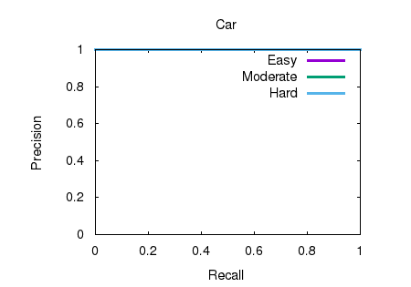
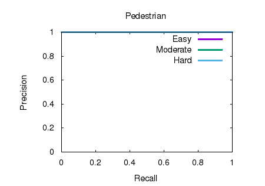
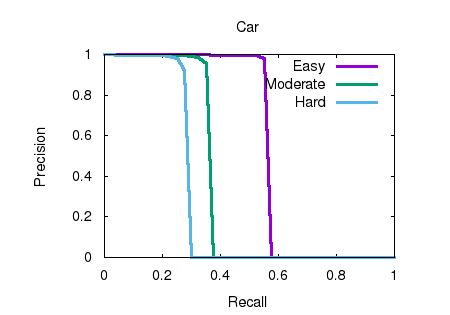
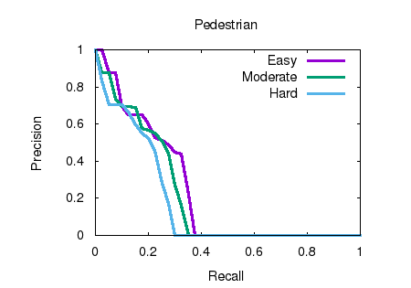
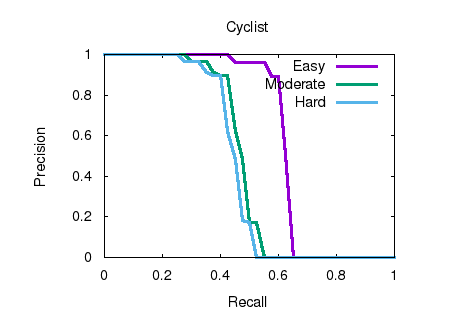

# Deep Learning Point Cloud Object Detection 

KITTI 3D Object Detection evaluation, Assignment 06 of [3D Point Cloud Processing](https://www.shenlanxueyuan.com/course/204) from [深蓝学院](https://www.shenlanxueyuan.com/)

---

## Environment Setup

The solution has been tested using **xenial-gpu**. Please follow the instruction in repo root to build and run the docker instance.

The Anaconda environment is avaiable at (click to follow the link) **[/workspace/assignments/06-deep-detection/environment/deep-detection.yaml](deep-detection.yaml)**
---

## Homework Solution

---

### Setup KITTI Object Detection Evaluation Toolkit

The adapted toolkit is available at (click to follow the link) **[/workspace/assignments/06-deep-detection/kitti-eval](kitti-eval)**

Use the following commands to compile and run it:

```bash
# build:
mkdir build
cd build && make 
# run:
./kitti_eval_node /workspace/data/kitti-3d-object-detection/training/label_2/ /workspace/data/kitti-3d-object-detection/training/pred_2/
```

---

### Generate Object Detection Results Using Ground Truth

In order to generate object detection results from ground truth labels, use the following script inside (click to follow the link) **[/workspace/assignments/06-deep-detection/kitti-eval/create_pred_from_ground_truth.py](kitti-eval)**

```bash
# create object detection results from ground truth labels:
./create_pred_from_ground_truth.py -i /workspace/data/kitti-3d-object-detection/training/label_2/ -o /workspace/data/kitti-3d-object-detection/training/pred_2/
```

The Python script uses Pandas to format ground truth labels as object detection results required by KITTI evaluation toolkit:

```python
#!/opt/conda/envs/deep-detection/bin/python

import argparse

import os
import glob

import pandas as pd

import progressbar


def generate_detection_results(input_dir, output_dir):
    """ 
    Create KITTI 3D object detection results from labels

    """
    # create output dir:
    os.mkdir(
        os.path.join(output_dir, 'data')
    )

    # get input point cloud filename:
    for input_filename in progressbar.progressbar(
        glob.glob(
            os.path.join(input_dir, '*.txt')
        )
    ):
        # read data:
        label = pd.read_csv(input_filename, sep=' ', header=None)
        label.columns = [
            'category',
            'truncation', 'occlusion', 
            'alpha',
            '2d_bbox_left', '2d_bbox_top', '2d_bbox_right', '2d_bbox_bottom', 
            'height', 'width', 'length', 
            'location_x', 'location_y', 'location_z',
            'rotation'
        ]
        # add score:
        label['score'] = 100.0
        # create output:
        output_filename = os.path.join(
            output_dir, 'data', os.path.basename(input_filename)
        )
        label.to_csv(output_filename, sep=' ', header=False, index=False)

def get_arguments():
    """ 
    Get command-line arguments

    """
    # init parser:
    parser = argparse.ArgumentParser("Generate KITTI 3D Object Detection result from ground truth labels.")

    # add required and optional groups:
    required = parser.add_argument_group('Required')

    # add required:
    required.add_argument(
        "-i", dest="input", help="Input path of ground truth labels.",
        required=True, type=str
    )
    required.add_argument(
        "-o", dest="output", help="Output path of detection results.",
        required=True, type=str
    )

    # parse arguments:
    return parser.parse_args()


if __name__ == '__main__':
    # parse arguments:
    arguments = get_arguments()

    generate_detection_results(arguments.input, arguments.output)
```

The output from KITTI evaluation toolkit can be found here (click to follow the link) **[/workspace/assignments/06-deep-detection/doc/eval-on-ground-truth](here)**. The three PR-curves for **Car, Pedestrian and Cyclist** are shown below.






---

### Generate Object Detection Results Using Point Pillars Prediction

In order to generate object detection results from point pillar predictions, use the adapted point pillars implementation by TuSimple (click to follow the link) **[/workspace/assignments/06-deep-detection/point-pillar/README.md](README.md)**

First, train the detectors for **car** and **pedestrian & cyclist**

```bash
# train car detector:
python ./pytorch/train.py train --config_path=./configs/pointpillars/car/xyres_16.config --model_dir=/workspace/assignments/06-deep-detection/models/trained_v1.6/16/car --resume=True
# train pedestrian & cyclist detector:
python ./pytorch/train.py train --config_path=./configs/pointpillars/ped_cycle/xyres_16.config --model_dir=/workspace/assignments/06-deep-detection/models/trained_v1.6/16/ped_cycle --resume=True
```

Then get prediction output as follows:

```bash
# evaluate car detector:
python ./pytorch/train.py evaluate --config_path=./configs/pointpillars/car/xyres_16.config --model_dir=/workspace/assignments/06-deep-detection/models/trained_v1.6/16/car --measure_time=True --batch_size=4 --pickle_result=False
# evaluate pedestrian & cyclist detector:
python ./pytorch/train.py evaluate --config_path=./configs/pointpillars/ped_cycle/xyres_16.config --model_dir=/workspace/assignments/06-deep-detection/models/trained_v1.6/16/ped_cycle --measure_time=True --batch_size=4 --pickle_result=False
```

Finally, evaluate model output using KITTI evaluation toolkit:

```bash
# create object detection results from point pillar detections:
./load_pred_from_point_pillars_pred.py -i /workspace/data/kitti-3d-object-detection/ -m /workspace/assignments/06-deep-detection/models/trained_v1.6/16/car -o /workspace/data/kitti-3d-object-detection/training/pred_2/
```

The Python script uses Pandas and SECOND APIs to format model detections as object detection results required by KITTI evaluation toolkit:

```python
#!/opt/conda/envs/deep-detection/bin/python

import argparse

import os
import glob
import shutil

import pickle
import second.data.kitti_dataset as kitti_ds

import pandas as pd

import progressbar

def get_model_detections(input_dir, model_dir, output_dir):
    """ 
    Create KITTI 3D object detection results from point pillars detections

    """    
    # init kitti dataset handler:
    kitti_dataset = kitti_ds.KittiDataset(
        root_path = input_dir,
        info_path = os.path.join(input_dir, 'kitti_infos_val.pkl'),
        class_names = ['Car', 'Pedestrian', 'Cyclist'], 
    )

    # load detection results:
    checkpoints = os.listdir(
        os.path.join(model_dir, 'results')
    )
    latest_checkpoint = max(
        checkpoints, key = lambda x: int(x.split('_')[-1])
    )
    latest_result = os.path.join(
        model_dir, 'results', latest_checkpoint, 'result.pkl'
    )

    print('[Point Pillar Evaluation]: load detections...')
    with open(latest_result, 'rb') as f:
        detections = pickle.load(f)

    # format as annotations:
    print('[Point Pillar Evaluation]: convert to annotations...')
    annos = kitti_dataset.convert_detection_to_kitti_annos(detections)

    # write intermediate results to temp output folder:
    print('[Point Pillar Evaluation]: save intermediate results...')
    kitti_ds.kitti_anno_to_label_file(annos, output_dir)

def generate_detection_results(input_dir, output_dir):
    """ 
    Create KITTI 3D object detection results from labels

    """
    # create output dir:
    os.mkdir(
        os.path.join(output_dir, 'data')
    )

    # get input point cloud filename:
    print('[Point Pillar Evaluation]: generate KITTI labels...')
    for input_filename in progressbar.progressbar(
        glob.glob(
            os.path.join(input_dir, '*.txt')
        )
    ):
        # read data:
        label = pd.read_csv(input_filename, sep=' ', header=None)
        label.columns = [
            'category',
            'truncation', 'occlusion', 
            'alpha',
            '2d_bbox_left', '2d_bbox_top', '2d_bbox_right', '2d_bbox_bottom', 
            'height', 'width', 'length', 
            'location_x', 'location_y', 'location_z',
            'rotation',
            'score'
        ]
        # add score:
        label['score'] *= 100.0
        # create output:
        output_filename = os.path.join(
            output_dir, 'data', os.path.basename(input_filename)
        )
        label[label['score'] == label['score'].max()].to_csv(output_filename, sep=' ', header=False, index=False)

def get_arguments():
    """ 
    Get command-line arguments

    """
    # init parser:
    parser = argparse.ArgumentParser("Generate KITTI 3D Object Detection result from ground truth labels.")

    # add required and optional groups:
    required = parser.add_argument_group('Required')

    # add required:
    required.add_argument(
        "-i", dest="input", help="Input path of ground truth labels.",
        required=True, type=str
    )
    required.add_argument(
        "-m", dest="model", help="Input path of point pillars model.",
        required=True, type=str
    )
    required.add_argument(
        "-o", dest="output", help="Output path of detection results.",
        required=True, type=str
    )

    # parse arguments:
    return parser.parse_args()


if __name__ == '__main__':
    # parse arguments:
    arguments = get_arguments()

    # init intermediate result buffer:
    if os.path.exists('pred_intermediate'):
        shutil.rmtree('pred_intermediate') 
    os.makedirs('pred_intermediate')

    get_model_detections(
        arguments.input,
        arguments.model,
        'pred_intermediate'      
    )

    # perform non-maximum supression:
    generate_detection_results('pred_intermediate', arguments.output)
    
    # remove intermediate result buffer:
    shutil.rmtree('pred_intermediate') 
```

The output from KITTI evaluation toolkit can be found here (click to follow the link) **[/workspace/assignments/06-deep-detection/doc/eval-on-pointpillars-trained](here)**. The three PR-curves for **Car, Pedestrian and Cyclist** are shown below.





