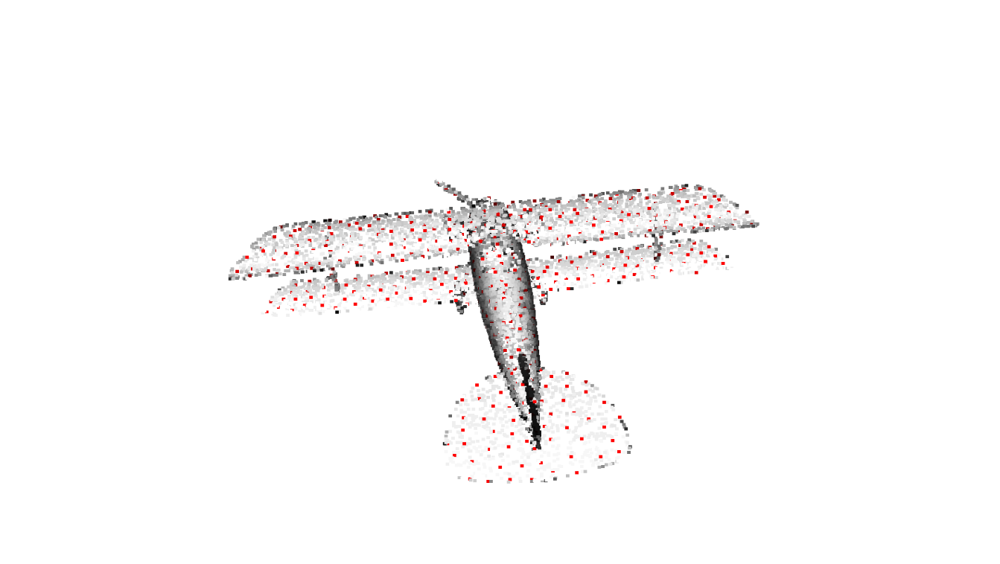
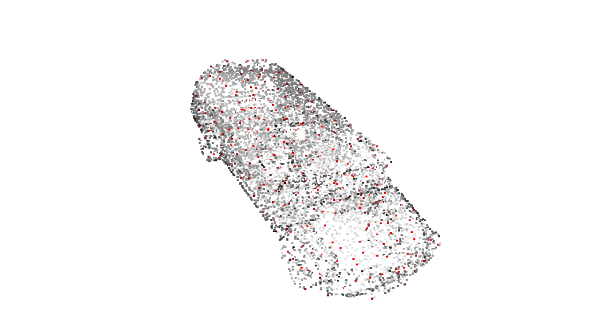
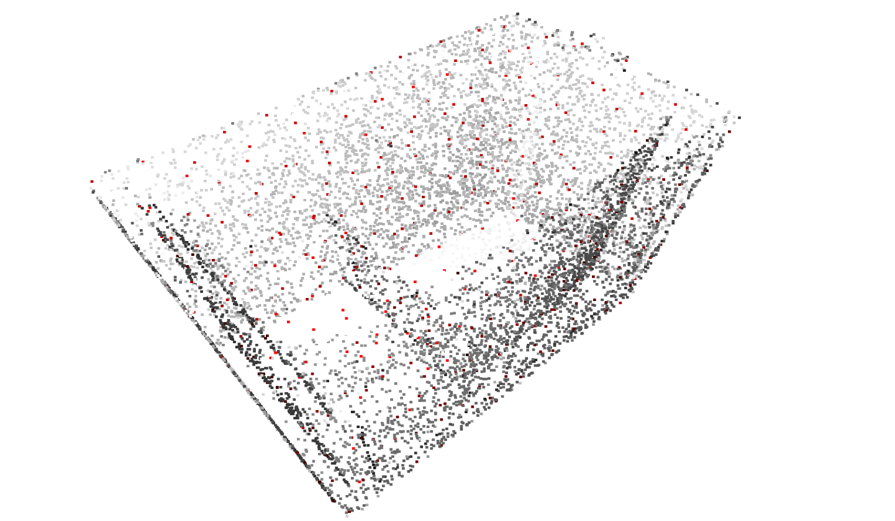

# Keypoint Detection for Point Cloud

Python implementation of Intrinsic Shape Signature(ISS) for Assignment 07 of [3D Point Cloud Processing](https://www.shenlanxueyuan.com/course/204) from [深蓝学院](https://www.shenlanxueyuan.com/)

---

## Environment Setup

The solution has been tested using **bionic-gpu**. Please follow the instruction in repo root to build and run the docker instance.

The Anaconda environment is avaiable at (click to follow the link) **[/workspace/assignments/07-feature-detection/environment/feature-detection.yaml](feature-detection.yaml)**
---

## Homework Solution

---

### ISS Implementation

The Python ISS implementation is available at (click to follow the link) **[/workspace/assignments/07-feature-detection/detect-iss.py](detect-iss.py)**

The key ideas behind this implementation is:

* **Cache** nearest neighbor counts for each point to avoid repeated computing
* Use **Max Heap** for efficient non-maximum suppression
* Use **Pandas DataFrame** for efficient parallel processing

```Python
# load point cloud
pcd = read_modelnet40_normal(input_filename)

# build search tree:
search_tree = o3d.geometry.KDTreeFlann(pcd)

# point handler:
points = np.asarray(pcd.points)

df_point_eigen_values = {
    'id': [],
    'lambda_0': [],
    'lambda_1': [],
    'lambda_2': []
}

# num rnn cache:
num_rnn_cache = {}
# heapq for non-maximum suppression:
pq = []
for idx_center, center in enumerate(
    points
):
    # find radius nearest neighbors:
    [k, idx_neighbors, _] = search_tree.search_radius_vector_3d(center, radius)

    # for each point get its nearest neighbors count:
    w = []
    deviation = []
    for idx_neighbor in np.asarray(idx_neighbors[1:]):
        # check cache:
        if not idx_neighbor in num_rnn_cache:
            [k_, _, _] = search_tree.search_radius_vector_3d(
                points[idx_neighbor], 
                radius
            )
            num_rnn_cache[idx_neighbor] = k_
        # update:
        w.append(num_rnn_cache[idx_neighbor])
        deviation.append(points[idx_neighbor] - center)
    
    # calculate covariance matrix:
    w = np.asarray(w)
    deviation = np.asarray(deviation)

    cov = (1.0 / w.sum()) * np.dot(
        deviation.T,
        np.dot(np.diag(w), deviation)
    )

    # get eigenvalues:
    w, _ = np.linalg.eig(cov)
    w = w[w.argsort()[::-1]]

    # add to pq:
    heapq.heappush(pq, (-w[2], idx_center))

    # add to dataframe:
    df_point_eigen_values['id'].append(idx_center)
    df_point_eigen_values['lambda_0'].append(w[0])
    df_point_eigen_values['lambda_1'].append(w[1])
    df_point_eigen_values['lambda_2'].append(w[2])

# non-maximum suppression:
suppressed = set()
while pq:
    _, idx_center = heapq.heappop(pq)
    if not idx_center in suppressed:
        # suppress its neighbors:
        [_, idx_neighbors, _] = search_tree.search_radius_vector_3d(
            points[idx_center], 
            radius
        )
        for idx_neighbor in np.asarray(idx_neighbors[1:]):
            suppressed.add(idx_neighbor)
    else:
        continue

# format:        
df_point_eigen_values = pd.DataFrame.from_dict(
    df_point_eigen_values
)

# first apply non-maximum suppression:
df_point_eigen_values = df_point_eigen_values.loc[
    df_point_eigen_values['id'].apply(lambda id: not id in suppressed),
    df_point_eigen_values.columns
]

# then apply decreasing ratio test:
df_point_eigen_values = df_point_eigen_values.loc[
    (df_point_eigen_values['lambda_0'] > df_point_eigen_values['lambda_1']) &
    (df_point_eigen_values['lambda_1'] > df_point_eigen_values['lambda_2']),
    df_point_eigen_values.columns
]

# paint background as grey:
pcd.paint_uniform_color([0.95, 0.95, 0.95])
# paint keypoints as red:
np.asarray(pcd.colors)[
    df_point_eigen_values['id'].values, :
] = [1.0, 0.0, 0.0]

o3d.visualization.draw_geometries([pcd])
```

---

### Keypoint Detection Results on ModelNet40

The following 3 samples are generated using the commands below:

```bash
# go to workspace:
cd /workspace/assignments/07-feature-detectionn
# activate environment:
conda activate feature-detection
# demo 01:
./detect-iss.py -i /workspace/data/modelnet40_normal_resampled/airplane/airplane_0001.txt -r 0.05
# demo 02:
./detect-iss.py -i /workspace/data/modelnet40_normal_resampled/car/car_0001.txt -r 0.10
# demo 03:
./detect-iss.py -i /workspace/data/modelnet40_normal_resampled/bathtub/bathtub_0001.txt -r 0.10
```







