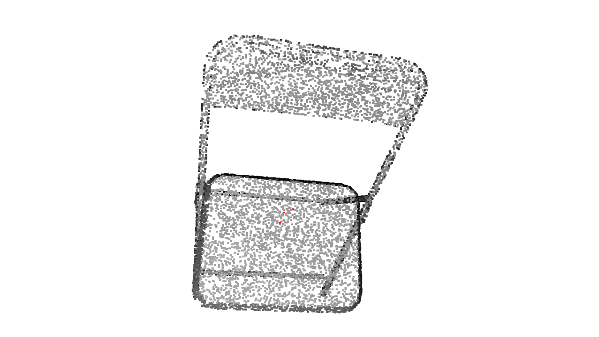
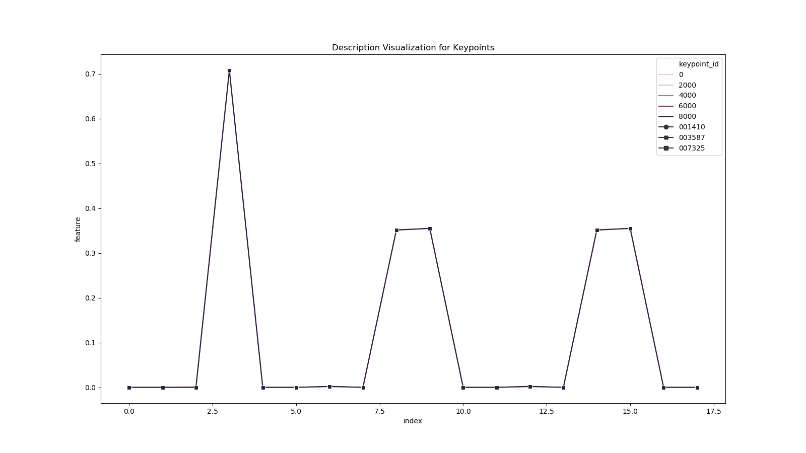
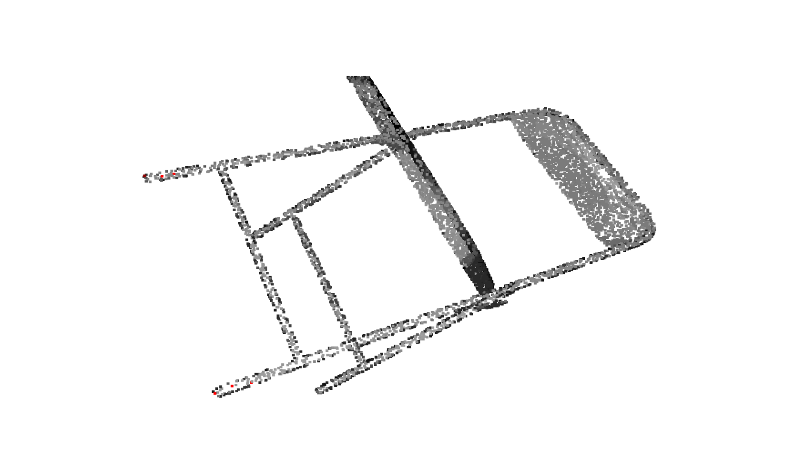

# Feature Description for Point Cloud

Python implementation of Fast Point Feature Histogram(FPFH) and Signature Histogram of OrienTations(SHOT)for Assignment 08 of [3D Point Cloud Processing](https://www.shenlanxueyuan.com/course/204) from [深蓝学院](https://www.shenlanxueyuan.com/)

---

## Environment Setup

The solution has been tested using **bionic-gpu**. Please follow the instruction in repo root to build and run the docker instance.

The Anaconda environment is avaiable at (click to follow the link) **[/workspace/assignments/08-feature-description/environment/feature-description.yaml](feature-detection.yaml)**
---

## Homework Solution

---

### FPFH Implementation

The Python ISS implementation is available at (click to follow the link) **[/workspace/assignments/08-feature-description/description/fpfh.py](fpfh.py)**

The implementation leverages the parallel computing ability of numpy to acelerate the feature description generation.

```Python
def get_spfh(point_cloud, search_tree, keypoint_id, radius, B):
    """
    Describe the selected keypoint using Simplified Point Feature Histogram(SPFH) 

    Parameters
    ----------
    point_cloud: Open3D.geometry.PointCloud
        input point cloud
    search_tree: Open3D.geometry.KDTree
        point cloud search tree
    keypoint_id: ind
        keypoint index
    radius: float
        nearest neighborhood radius
    B: float
        number of bins for each dimension

    Returns
    ----------

    """    
    # points handler:
    points = np.asarray(point_cloud.points)

    # get keypoint:
    keypoint = np.asarray(point_cloud.points)[keypoint_id]

    # find radius nearest neighbors:
    [k, idx_neighbors, _] = search_tree.search_radius_vector_3d(keypoint, radius)
    # remove query point:
    idx_neighbors = idx_neighbors[1:]
    # get normalized diff:
    diff = points[idx_neighbors] - keypoint 
    diff /= np.linalg.norm(diff, ord=2, axis=1)[:,None]

    # get n1:
    n1 = np.asarray(point_cloud.normals)[keypoint_id]
    # get u:
    u = n1
    # get v:
    v = np.cross(u, diff)
    # get w:
    w = np.cross(u, v)

    # get n2:
    n2 = np.asarray(point_cloud.normals)[idx_neighbors]
    # get alpha:
    alpha = (v * n2).sum(axis=1)
    # get phi:
    phi = (u*diff).sum(axis=1)
    # get theta:
    theta = np.arctan2((w*n2).sum(axis=1), (u*n2).sum(axis=1))

    # get alpha histogram:
    alpha_histogram = np.histogram(alpha, bins=B, range=(-1.0, +1.0))[0]
    alpha_histogram = alpha_histogram / alpha_histogram.sum()
    # get phi histogram:
    phi_histogram = np.histogram(phi, bins=B, range=(-1.0, +1.0))[0]
    phi_histogram = phi_histogram / phi_histogram.sum()
    # get theta histogram:
    theta_histogram = np.histogram(theta, bins=B, range=(-np.pi, +np.pi))[0]
    theta_histogram = theta_histogram / theta_histogram.sum()

    # build signature:
    signature = np.hstack(
        (   
            # alpha:
            alpha_histogram,
            # phi:
            phi_histogram,
            # theta:
            phi_histogram
        )
    )

    return signature

def describe(point_cloud, search_tree, keypoint_id, radius, B):
    """
    Describe the selected keypoint using Fast Point Feature Histogram(FPFH)

    Parameters
    ----------
    point_cloud: Open3D.geometry.PointCloud
        input point cloud
    search_tree: Open3D.geometry.KDTree
        point cloud search tree
    keypoint_id: ind
        keypoint index
    radius: float
        nearest neighborhood radius
    B: float
        number of bins for each dimension

    Returns
    ----------

    """
    # points handler:
    points = np.asarray(point_cloud.points)

    # get keypoint:
    keypoint = np.asarray(point_cloud.points)[keypoint_id]

    # find radius nearest neighbors:
    [k, idx_neighbors, _] = search_tree.search_radius_vector_3d(keypoint, radius)

    if k <= 1:
        return None

    # remove query point:
    idx_neighbors = idx_neighbors[1:]

    # weights:
    w = 1.0 / np.linalg.norm(
        points[idx_neighbors] - keypoint, ord=2, axis=1
    )

    # SPFH from neighbors:
    X = np.asarray(
        [get_spfh(point_cloud, search_tree, i, radius, B) for i in idx_neighbors]
    )

    # neighborhood contribution:
    spfh_neighborhood = 1.0 / (k - 1) * np.dot(w, X)

    # query point spfh:
    spfh_query = get_spfh(point_cloud, search_tree, keypoint_id, radius, B)

    # finally:
    spfh = spfh_query + spfh_neighborhood

    # normalize again:
    spfh = spfh / np.linalg.norm(spfh)

    return spfh
```

---

### Keypoint Feature Description Results on ModelNet40

The following 2 samples are generated using the commands below:

```bash
# go to workspace:
cd /workspace/assignments/08-feature-description
# activate environment:
conda activate feature-description
# demo:
./main.py -i /workspace/data/modelnet40_normal_resampled/chair/chair_0001.txt -r 0.05
```

Model View                |Feature Description View
:-------------------------:|:-------------------------:
  |  
  |  

From the visualization we know that:

* The descriptor will give exactly the same signature on flat plane(Row 01).
* The descriptor will generate strongly correlated signatures in similar area(Row 02).

Which proves the correctness of the implementation.