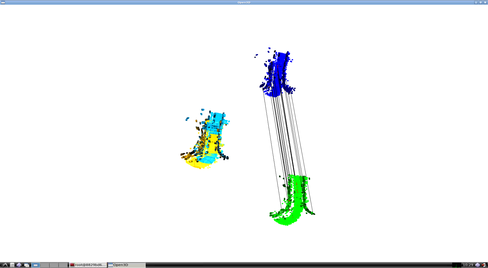
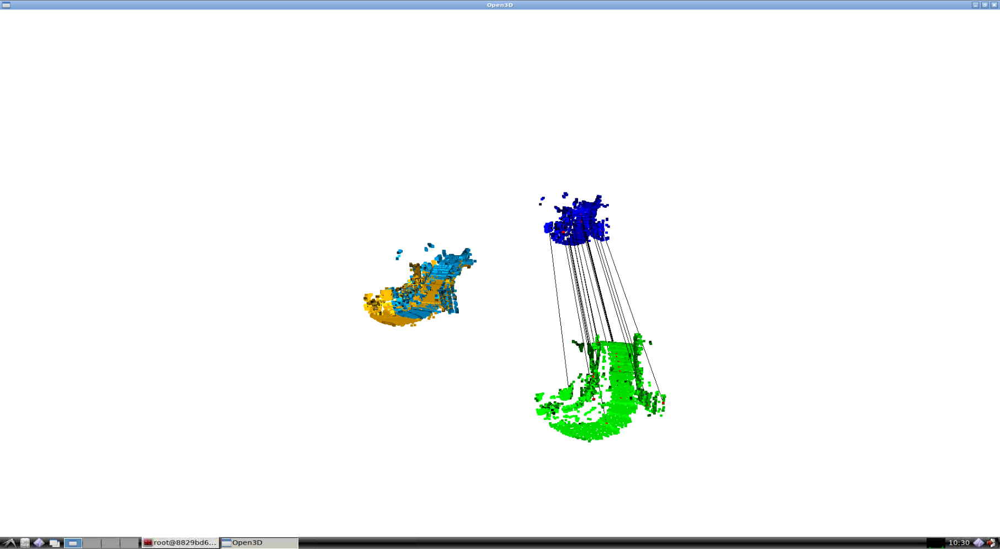
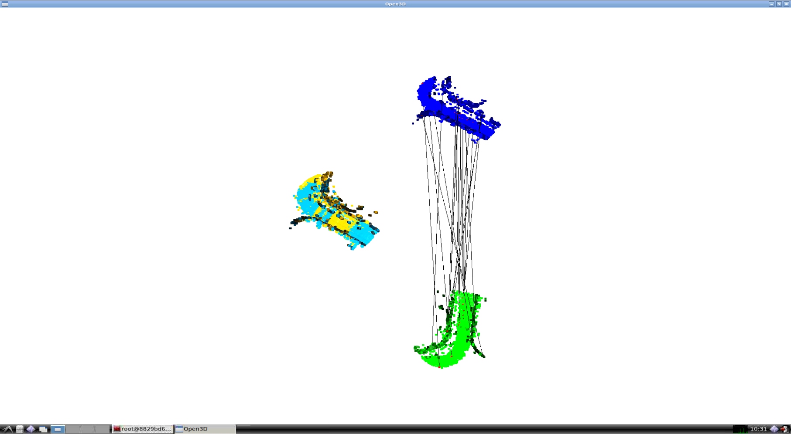
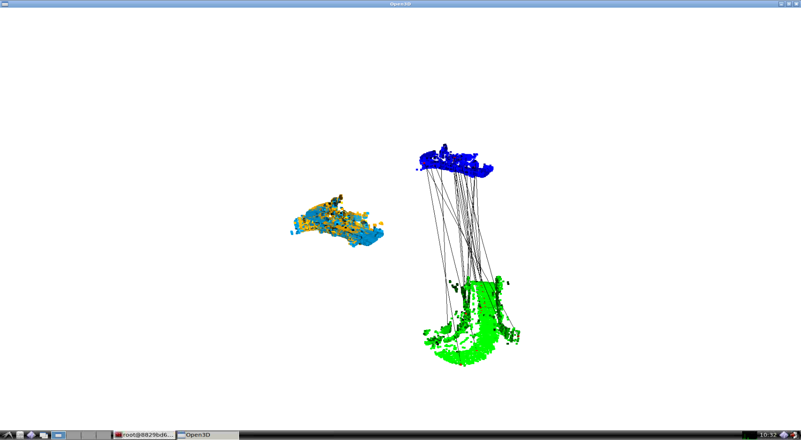
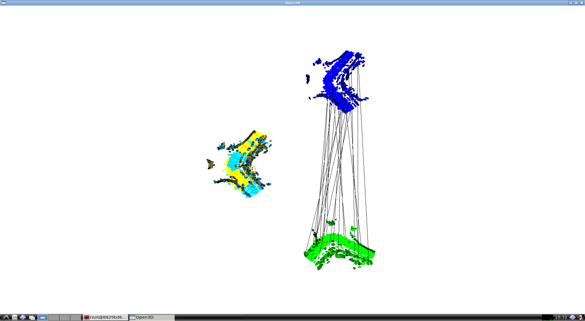
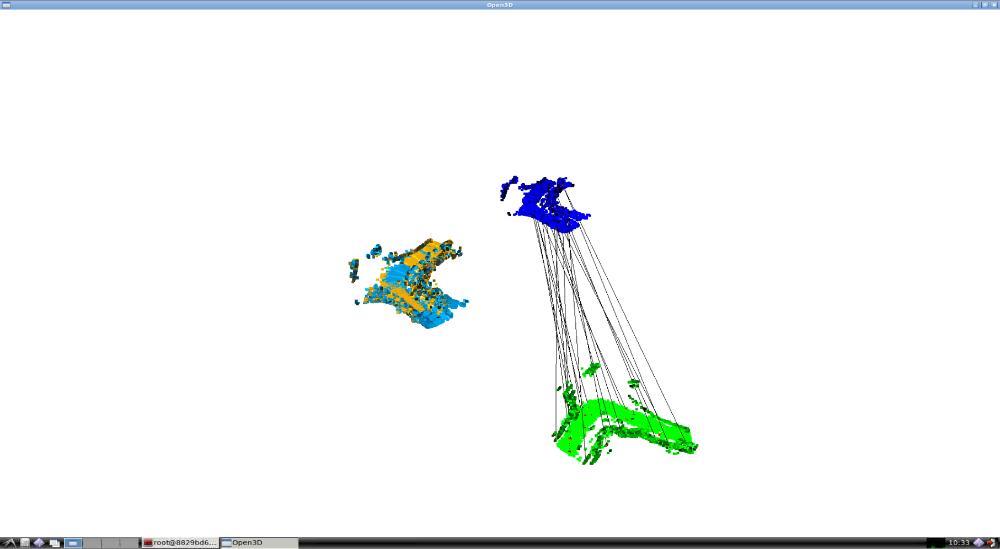
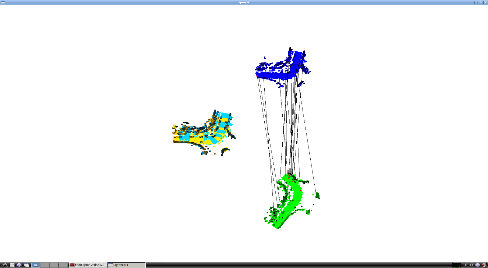
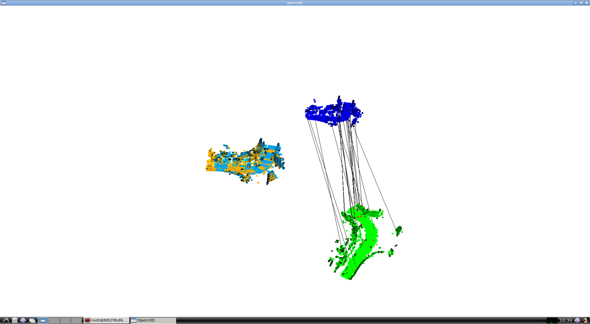

# 3D Point Cloud Registration

Python implementation of 3D Point Cloud Registration for Assignment 09 of [3D Point Cloud Processing](https://www.shenlanxueyuan.com/course/204) from [深蓝学院](https://www.shenlanxueyuan.com/)

---

## Environment Setup

The solution has been tested using **bionic-gpu**. Please follow the instruction in repo root to build and run the docker instance.

The Anaconda environment is avaiable at (click to follow the link) **[/workspace/assignments/09-point-cloud-registration/environment/point-cloud-registration.yaml](environment/point-cloud-registration.yaml)**
---

## Homework Solution

---

### RANSAC Point-to-Point ICP Implementation

The Python implementation is available at (click to follow the link) **[/workspace/assignments/09-point-cloud-registration/main.py](main.py)**

The algorithm workflow is as follows:

* First, detect keypoint using ISS
* Then, downsample the original point cloud and keep only the keypoints
* Calculate FPFH around keypoints
* Use RANSAC on downsampled point cloud for initial pose estimation
* Perform the initial refinement using the keypoint cloud
* Perform the final refinement using the original point cloud
* Visualize the registration and keypoint association based on feature mapping

All the helper functions are available inside (click to follow the link) **[/workspace/assignments/09-point-cloud-registration/association/ransac_icp.py](association)**

```Python
def main(
    input_dir, radius, bins, num_evaluations
):
    """
    Run point cloud registration on Shenlan dataset
    """
    registration_results = io.read_registration_results(
        os.path.join(input_dir, 'reg_result.txt')
    )

    # init output
    df_output = io.init_output()

    for i, r in progressbar.progressbar(
        registration_results.iterrows()
    ):
        if i >= 3:
            exit(0)
        
        # parse point cloud index:
        idx_target = int(r['idx1'])
        idx_source = int(r['idx2'])

        # load point clouds:
        pcd_source = io.read_point_cloud_bin(
            os.path.join(input_dir, 'point_clouds', f'{idx_source}.bin')
        )
        # pcd_source, idx_inliers = pcd_source.remove_radius_outlier(nb_points=4, radius=radius)
        search_tree_source = o3d.geometry.KDTreeFlann(pcd_source)

        pcd_target = io.read_point_cloud_bin(
            os.path.join(input_dir, 'point_clouds', f'{idx_target}.bin')
        )
        # pcd_target, idx_inliers = pcd_target.remove_radius_outlier(nb_points=4, radius=radius)
        search_tree_target = o3d.geometry.KDTreeFlann(pcd_target)

        # detect keypoints:
        keypoints_source = detect(pcd_source, search_tree_source, radius)
        keypoints_target = detect(pcd_target, search_tree_target, radius)

        # create descriptions:
        pcd_source_keypoints = pcd_source.select_by_index(keypoints_source['id'].values)
        fpfh_source_keypoints = o3d.registration.compute_fpfh_feature(
            pcd_source_keypoints, 
            o3d.geometry.KDTreeSearchParamHybrid(radius=5*radius, max_nn=100)
        )

        pcd_target_keypoints = pcd_target.select_by_index(keypoints_target['id'].values)
        fpfh_target_keypoints = o3d.registration.compute_fpfh_feature(
            pcd_target_keypoints, 
            o3d.geometry.KDTreeSearchParamHybrid(radius=5*radius, max_nn=100)
        )

        # generate matches:
        distance_threshold_init = 2.5 * radius
        distance_threshold_final = 2.5 * radius

        # RANSAC for initial estimation:
        init_result = ransac_match(
            pcd_source_keypoints, pcd_target_keypoints, 
            fpfh_source_keypoints, fpfh_target_keypoints,    
            ransac_params = RANSACParams(
                num_samples=4, 
                max_correspondence_distance=distance_threshold_final,
                max_iteration=100000, 
                max_validation=500,
                max_refinement=30
            ),
            checker_params = CheckerParams(
                max_correspondence_distance=distance_threshold_init,
                max_edge_length_ratio=0.8,
                normal_angle_threshold=None
            )      
        )

        # exact ICP for refined estimation:
        final_transform = exact_match(
            pcd_source, pcd_target, search_tree_target,
            init_result.registration_result.transformation,
            distance_threshold_final, 60
        )
        final_result = o3d.registration.evaluate_registration(
            pcd_source, pcd_target, distance_threshold_final, final_transform
        )

        # visualize:
        visualize.show_registration_result(
            pcd_source_keypoints, pcd_target_keypoints, init_result.registration_result.correspondence_set,
            pcd_source, pcd_target, final_result.transformation
        )
        io.add_to_output(df_output, idx_target, idx_source, final_result.transformation)

    # write output:
    io.write_output(
        os.path.join(input_dir, 'reg_result_yaogefad.txt'),
        df_output
    )
```

---

### Point Cloud Registration Results on Shenlan Datasets

The following 4 samples are generated using the commands below:

```bash
# go to workspace:
cd /workspace/assignments/09-point-cloud-registration
# activate environment:
conda activate point-cloud-registration
# demo:
./main.py -i /workspace/data/registration_dataset/ -r 0.5 -b 11
```

Top View                |Side View
:-------------------------:|:-------------------------:
  |  
  |  
  |  
  |  

From the visualization we know that:

* The keypoint detector & descriptor will give good enough initial pose estation, which can be seen from the right side of the screenshot.
* Based on the above initial pose, the two point clouds can be registered successfully, which is shown in the left side of the screenshot.

Besides, below are the results from the evaluation on the 3 samples having ground truth:

```bash
# go to dataset directory:
cd /workspace/data/registration_dataset
# run evaluation script:
python evaluate_rt.py
# below are results:
['643', '456', '-4.382037298516101', '-5.862927366322151', '-1.0060765119858335', '0.9997640898229918', '0.012090978475217501', '0.0058373185960602664', '-0.017073331588323352']
['0', '456', '0.9897074742848273', '1.7164674057694422', '-0.13744879799387744', '-0.5442035929836387', '0.0026942738808409168', '-0.006903306707538558', '0.8389204578674039']
['645', '189', '-0.609386200829236', '4.185799862906377', '-0.09217751265915752', '0.7635073897100935', '0.001873205229395615', '0.008175349363382491', '0.6457446249277145']
Registration successful rate: 0.75, successful counter: 3, 
average Relative Translation Error (RTE): 0.18, average Relative Rotation Error (RRE): 0.81
```

The above two tests prove the correctness of the implementation.