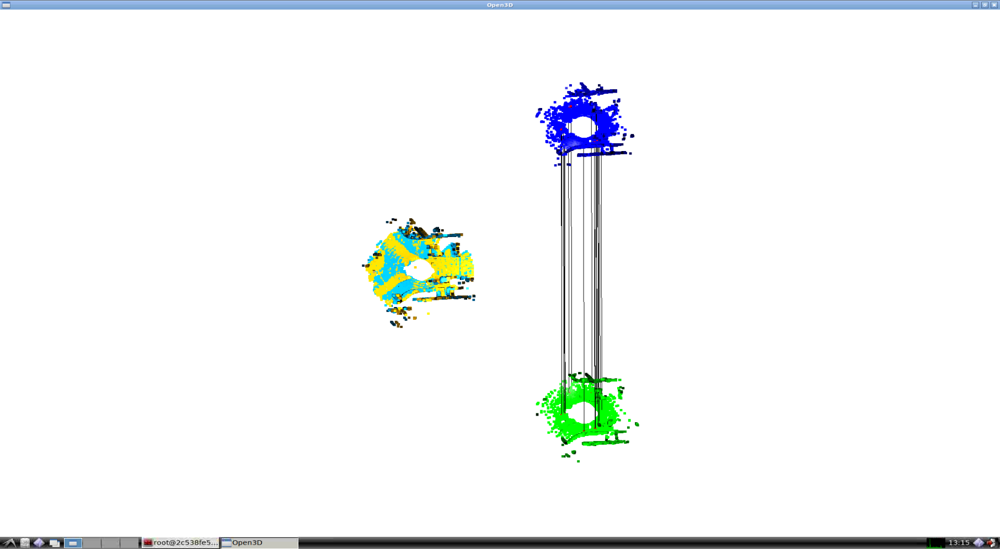
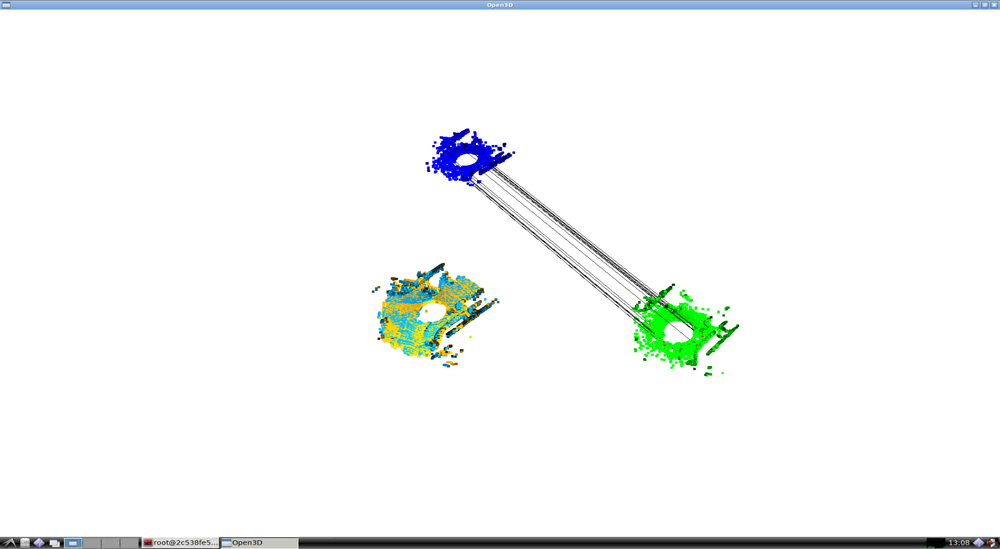

# State Estimation for Robotics 

Python implementation of ICP Pose Estimation for Assignment 07 of [State Estimation for Robotics](https://www.shenlanxueyuan.com/course/251) from [深蓝学院](https://www.shenlanxueyuan.com/)

---

## Environment Setup

The solution has been tested using **bionic-gpu**. Please follow the instruction in repo root to build and run the docker instance.

The Anaconda environment is avaiable at (click to follow the link) **[/workspace/assignments/10-pose-estimation/environment/point-cloud-registration.yaml](environment/point-cloud-registration.yaml)**
---

## Homework Solution

---

### RANSAC Point-to-Point ICP Implementation

The Python implementation is available at (click to follow the link) **[/workspace/assignments/10-pose-estimation/main.py](main.py)**

The algorithm workflow is as follows:

* First, detect keypoint using ISS
* Then, downsample the original point cloud and keep only the keypoints
* Calculate FPFH around keypoints
* Use RANSAC on downsampled point cloud for initial pose estimation
* Perform the initial refinement using the keypoint cloud
* Perform the final refinement using the original point cloud
* Visualize the registration and keypoint association based on feature mapping

All the helper functions are available inside (click to follow the link) **[/workspace/assignments/10-pose-estimation/association/ransac_icp.py](association)**

```Python
def main(
    input_dir, radius, bins, num_evaluations
):
    """
    Run pose estimation on given point cloud pair
    """
    # load source & target point clouds:
    pcd_source = o3d.io.read_point_cloud(
        os.path.join(input_dir, "first.pcd")
    )
    pcd_source = pcd_source.voxel_down_sample(
        voxel_size=0.05
    )
    pcd_source.estimate_normals(
        search_param=o3d.geometry.KDTreeSearchParamHybrid(radius=0.1, max_nn=30)
    )
    pcd_target = o3d.io.read_point_cloud(
        os.path.join(input_dir, "second.pcd")
    )
    pcd_target = pcd_target.voxel_down_sample(
        voxel_size=0.05
    )
    pcd_target.estimate_normals(
        search_param=o3d.geometry.KDTreeSearchParamHybrid(radius=0.1, max_nn=30)
    )

    # build search trees:
    pcd_source, idx_inliers = pcd_source.remove_radius_outlier(nb_points=4, radius=radius)
    search_tree_source = o3d.geometry.KDTreeFlann(pcd_source)

    pcd_target, idx_inliers = pcd_target.remove_radius_outlier(nb_points=4, radius=radius)
    search_tree_target = o3d.geometry.KDTreeFlann(pcd_target)

    # detect keypoints:
    keypoints_source = detect(pcd_source, search_tree_source, radius)
    keypoints_target = detect(pcd_target, search_tree_target, radius)

    # create descriptions:
    pcd_source_keypoints = pcd_source.select_by_index(keypoints_source['id'].values)
    fpfh_source_keypoints = o3d.registration.compute_fpfh_feature(
        pcd_source_keypoints, 
        o3d.geometry.KDTreeSearchParamHybrid(radius=5*radius, max_nn=100)
    ).data

    pcd_target_keypoints = pcd_target.select_by_index(keypoints_target['id'].values)
    fpfh_target_keypoints = o3d.registration.compute_fpfh_feature(
        pcd_target_keypoints, 
        o3d.geometry.KDTreeSearchParamHybrid(radius=5*radius, max_nn=100)
    ).data

    # generate matches:
    distance_threshold_init = 1.5 * radius
    distance_threshold_final = 1.0 * radius

    # RANSAC for initial estimation:
    init_result = ransac_match(
        pcd_source_keypoints, pcd_target_keypoints, 
        fpfh_source_keypoints, fpfh_target_keypoints,    
        ransac_params = RANSACParams(
            max_workers=5,
            num_samples=4, 
            max_correspondence_distance=distance_threshold_init,
            max_iteration=200000, 
            max_validation=500,
            max_refinement=30
        ),
        checker_params = CheckerParams(
            max_correspondence_distance=distance_threshold_init,
            max_edge_length_ratio=0.9,
            normal_angle_threshold=None
        )      
    )

    # exact ICP for refined estimation:
    final_result = exact_match(
        pcd_source, pcd_target, search_tree_target,
        init_result.transformation,
        distance_threshold_final, 60
    )

    # visualize:
    visualize.show_registration_result(
        pcd_source_keypoints, pcd_target_keypoints, init_result.correspondence_set,
        pcd_source, pcd_target, final_result.transformation
    )

    # init output
    df_output = io.init_output()

    # add result:
    io.add_to_output(df_output, 2, 1, final_result.transformation)

    # write output:
    io.write_output(
        os.path.join(input_dir, 'reg_result_yaogefad.txt'),
        df_output
    )
```

---

### Point Cloud Registration Results on Shenlan Datasets

The following 4 samples are generated using the commands below:

```bash
# go to workspace:
cd /workspace/assignments/10-pose-estimation
# activate environment:
conda activate point-cloud-registration
# demo:
./main.py -i /workspace/data/registration_dataset/ -r 0.10 -b 11
```

Top View                |Side View
:-------------------------:|:-------------------------:
  |  

From the visualization we know that:

* The keypoint detector & descriptor will give good enough initial pose estation, which can be seen from the right side of the screenshot.
* Based on the above initial pose, the two point clouds can be registered successfully, which is shown in the left side of the screenshot.

The final estimation result is:

|     Tx    |    Ty    |    Tz    |    qx    |     qy    |    qz    |    qw    |
|:---------:|:--------:|:--------:|:--------:|:---------:|:--------:|:--------:|
| -0.233844 | 0.031201 | 0.010191 | 0.999998 | -0.000593 | 0.001337 | 0.001402 |